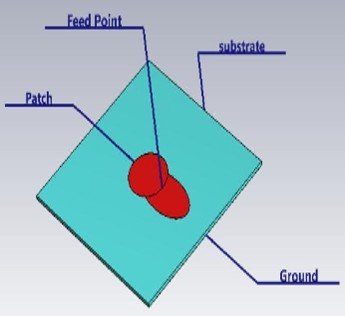
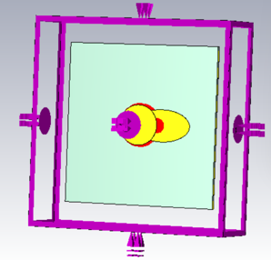
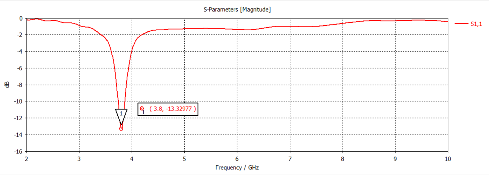
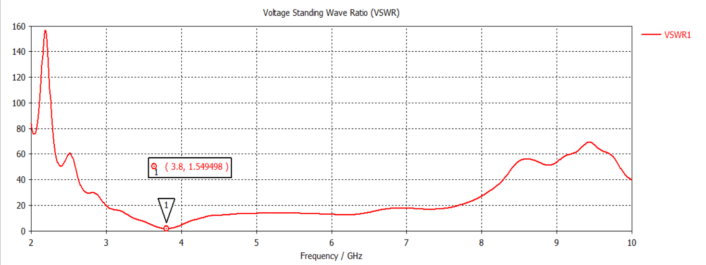
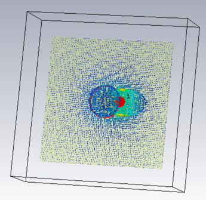
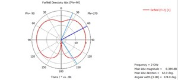

# DESIGN-AND-ANALYSIS-OF-AN-OLOID-SHAPED-MICROSTRIP-PATCH-ANTENNA-FOR-S-BAND-RADAR-SYSTEMS

The proposed antenna is designed for S-band radar applications operating at 3.8 GHz. The antenna uses an oloid-shaped radiating patch to improve surface current distribution, impedance matching, and radiation characteristics. The design is simulated and analyzed using CST Studio Suite 2025.

# Compact Oloid-Shaped Microstrip Patch Antenna for S-Band Radar Applications

A compact microstrip patch antenna developed using FR-4 substrate material and simulated using CST Studio Suite for radar and wireless communication applications.

---

# 📌 Project Overview

Modern radar and wireless communication systems require compact antennas with good impedance matching and stable radiation performance.

This project provides:

- Compact antenna design
- Improved surface current distribution
- Stable radiation characteristics
- Good impedance matching
- Low-cost antenna structure
- CST-based electromagnetic simulation
- S-band radar operation

The proposed antenna improves antenna performance using a modified oloid-shaped geometry without significantly increasing antenna size.

---

# 🖼️ Project Preview

## Antenna Geometry

## CST Simulation Model

## S11 Result

## VSWR Result

## Surface Current Distribution

## Radiation Pattern

---

# 🚀 Features

- Oloid-shaped compact antenna design
- Operates at 3.8 GHz S-band frequency
- Improved impedance matching
- Return Loss (S11) = −13 dB
- VSWR = 1.54
- Stable surface current distribution
- Compact and low-profile structure
- Simple and low-cost design
- Simulated using CST Studio Suite 2025

---

# 📐 Antenna Specifications

| Parameter | Value |
|-----------|-------|
| Antenna Type | Microstrip Patch Antenna |
| Patch Shape | Oloid-Shaped |
| Operating Frequency | 3.8 GHz |
| Substrate Material | FR-4 |
| Dielectric Constant | 4.4 |
| Feeding Technique | Discrete Port |
| Return Loss (S11) | −13 dB |
| VSWR | 1.54 |
| Application | S-Band Radar |

---

# ⚙️ Working Principle

1. The discrete port excites the antenna between the patch and ground plane.

2. Electromagnetic energy generates surface currents on the oloid-shaped patch.

3. The modified geometry increases the effective current path length.

4. The antenna resonates at 3.8 GHz.

5. The antenna radiates electromagnetic waves into free space.

6. CST simulation analyzes antenna parameters such as:
   - S11
   - VSWR
   - Surface Current
   - Radiation Pattern
   - Gain
   - Directivity

---

# 💻 Software Used

- CST Studio Suite 2025
- Electromagnetic Simulation
- Time Domain Solver

---

# 🔬 Technologies Used

- Microstrip Patch Antenna Design
- RF Engineering
- Electromagnetic Simulation
- CST Microwave Studio
- Wireless Communication
- Radar System Design

---

# 📡 Applications

- S-Band Radar Systems
- Wireless Communication Systems
- RF Research Applications
- Embedded Communication Devices
- Antenna Research and Development

---

# 📊 Output

The proposed antenna successfully:

- Resonates at 3.8 GHz
- Achieves S11 = −13 dB
- Maintains VSWR = 1.54
- Improves impedance matching
- Enhances surface current distribution
- Provides stable radiation characteristics

---

# 🔮 Future Enhancements

- Gain improvement using antenna arrays
- Bandwidth enhancement techniques
- Low-loss substrate implementation
- Defected Ground Structure (DGS)
- Advanced radar integration
- Multi-band antenna design

---

# 📚 Literature Survey References

1. R. Sharma and P. Singh,  
“Compact Microstrip Patch Antenna for S-Band Radar Applications,”  
International Journal of RF and Microwave Engineering,  
vol. 15, no. 2, pp. 45–50, 2024.

2. M. Rahman and K. Lee,  
“Circular-Elliptical Hybrid Patch Antenna for Wireless Systems,”  
IEEE International Conference on Wireless Communication Systems,  
pp. 120–125, 2024.

3. A. Kumar and S. Verma,  
“Geometry-Modified Microstrip Patch Antenna for Size Reduction,”  
International Journal of Antenna and Propagation,  
vol. 18, no. 4, pp. 88–94, 2023.

4. D. Patel and R. Mehta,  
“Microstrip Patch Antenna Using FR4 Substrate for S-Band Applications,”  
International Journal of Communication Engineering,  
vol. 10, no. 1, pp. 32–37, 2023.

5. J. Wang and L. Chen,  
“Compact Single-Band Microstrip Patch Antenna for Radar Systems,”  
IEEE Transactions on Antennas and Propagation,  
vol. 72, no. 3, pp. 210–216, 2025.

---

# 📂 Repository Structure

├── CST_Design  
│   └── antenna_design.cst

├── Images  
│   ├── antenna_geometry.png  
│   ├── cst_simulation_model.png  
│   ├── s11_result.png  
│   ├── vswr_result.png  
│   ├── surface_current.png  
│   ├── radiation_pattern.png  
│   └── block_diagram.png

├── Paper  
│   └── journal_paper.pdf

├── PPT  
│   └── project_presentation.pptx

├── Report  
│   └── final_report.pdf

└── README.md

---

# 👨‍💻 Authors

Developed as an academic RF and antenna design project by ECE students.

---

# 📄 Research Publication

This project work has been successfully published in:

International Journal of Creative Research Thoughts (IJCRT)

---

# 🙏 Acknowledgement

I would like to express my sincere gratitude to our mentor Mrs. N. Srividhya for her valuable guidance, continuous support, and encouragement throughout this project work.

---

# 📜 License

This project is licensed under the MIT License.

---

# ✅ Conclusion

The proposed Oloid-Shaped Microstrip Patch Antenna demonstrates a compact and efficient antenna design for S-band radar applications. The antenna achieves good impedance matching and stable radiation performance using a modified oloid geometry. The project highlights the importance of geometry-based optimization in modern antenna system design.
